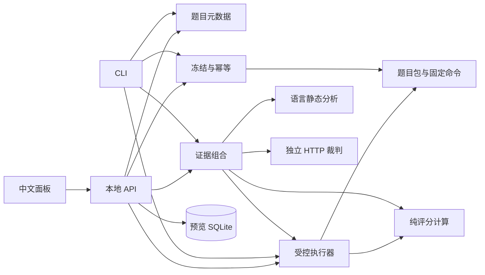

# 技术栈与架构

需求和技术路线已经确认，当前交付状态见 [交接手册](handoff.md)。采用单机模块化架构，进程隔离放在候选执行边界。

## 技术选择

| 层 | 实际选择 |
| --- | --- |
| 平台 | TypeScript 6、Node 24.14.1、pnpm 11.24.0 workspace，单锁文件 |
| 中文面板 | React 19、Vite 8，CLI 提交、Web 查询与选择汇总 |
| API/协议 | Fastify 5、TypeBox 1；严格 Schema，不隐式转换或删除未知字段 |
| 存储 | Node 内置 SQLite 保存预览；文件快照、JSON/JSONL 保存实际运行 |
| 平台验收 | Vitest、Playwright；高风险逻辑、真实提交及浏览器报告流程 |
| 被测运行时 | TypeScript/Node、F#/.NET 10、Python 3；浏览器题实际启动 Edge/Chromium |
| 执行环境 | Windows 本机诊断；按 image ID 固定的 Linux 容器；二者分列 |

SQLite 驱动集中在 apps/api/src/store.ts；Node 当前版本会提示实验性 API。存储是单写者模型，不作为多机共享数据库。

## 模块依赖

| 包 | 责任与边界 |
| --- | --- |
| contracts | Schema、类型和评分常量，不管理进程/数据库 |
| core | 50/50、关键项、缺测、四级、配对测量纯计算，不读文件/网络/模型 |
| catalog | 题目与来源元数据，不执行候选 |
| tasks | manifest、白名单导出、受信检查安装、三向验证 |
| runs | 身份、快照摘要、幂等索引、事件与物化，不决定分数 |
| executor | 固定命令执行、容器传输、故障/回收、证据与评分修订；质量通过回调接入 |
| static | TypeScript AST、Python AST、FSharp.Compiler.Service 读取源码，不执行候选 |
| judge | HTTP 协议、预算、缓存、版本及证据校验、两轮比较；没有凭据即拒绝 |
| evaluation | 组合冻结源码、静态/性能/裁判证据，显式选择作答汇总 |

候选进程不持有模型令牌，评分核心不绑定某个裁判或前端。没有为单机需求引入 Redis、分布式队列或微服务。

平台 typecheck 覆盖平台及核心题；集成 starter 是保留上游结构的源码副本，不套用本项目 strict 配置。集成题通过自身固定命令加载真实模块并执行契约；当前不声称已完成上游仓库全量类型检查，保留的类型依赖与运行时替身范围见各题来源说明。

## 入口

| 接口 | 行为 |
| --- | --- |
| GET /api/health | 运行档案、提交入口配置、实际容器/固定镜像探测、裁判配置状态；配置不等于已成功调用 |
| GET /api/tasks | 55 道题元数据与实际状态 |
| GET/POST /api/previews | 独立存储调用者证据的评分预览，始终为 preview |
| POST /api/runs | 有效 x-bench-token + 提交根目录约束；冻结后自动验证与评审 |
| GET /api/runs | 运行与尝试列表 |
| GET /api/runs/:runId/:attemptId | 阶段、结论、失败、可重试原因及评分 |
| GET .../detail、.../report、.../artifacts/:id | JSON/事件、Markdown、核对路径和哈希后的证据下载 |
| POST .../cancel、.../retry、.../review、.../human-review | 需要令牌的取消、同快照重试、独立补评和人工修订 |
| POST /api/summaries | 显式选择一次作答/题，拒绝重复、旧题版本及不同环境，缺测不补分 |

CLI 提供 list/show/score、submit/status/runs、review/report/summary。bench score 是预览；submit 才执行候选，完成原因可为 agent-completed、operator-submit、patch-import。当前提交接收工作区快照；补丁先在导出的独立工作区应用，再以 patch-import 提交。

裁判配置可用 `bench judge-config` 离线检查。judge包按供应商协议生成请求、校验模型参数并处理usage，evaluation包只消费统一判决与配置指纹。当前支持8家供应商及4种协议，详情见 [供应商矩阵](judge-providers.md)；没有为各供应商引入SDK。`task:mutants`是题目作者的独立验收入口，不属于候选可调用的裁判工具。

API 监听127.0.0.1:4318，Vite 同源代理。BENCH_RUN_DIR 指定运行存储，默认 data/runs。提交写入口需 BENCH_SUBMISSIONS_DIR 和 BENCH_RUN_TOKEN；请求上限256KiB，候选目录做 realpath 校验。接口不接受 shell 命令。公开托管、多租户及作答模型自动编排不在范围内。

## 执行与信任边界

完成信号只触发验收。平台重算候选哈希，冻结后复制到受控工作目录，使用平台 manifest 命令与检查。重复同键同快照复用，冲突报409；修改代码属于新的作答。同快照重试及补评追加 execution-N，查询最新已完成修订，不覆盖历史。

候选只收到 task.md、starter、public-tests 等白名单；隐藏检查和参考解不随导出发布。Node 验证使用独立测试进程，防止候选 stdout 冒充顶层 TAP；重复 ID、非零退出、输出超限与关键项失败独立处理。F#/Python 同进程验证仍有篡改边界，不能宣传为对抗恶意候选的完全隔离判分。

Linux 容器采用固定镜像、不拉取、网络关闭、CPU/内存/PID 限额、只读根与检查挂载、非 root、cap-drop/no-new-privileges；超时/取消终止并回收容器。运行时隐藏检查仍可被候选读取。根目录和 Docker socket 不挂入容器。Windows 本机仅诊断，不声称资源/网络隔离。

当前Docker/WSL已在用户重启后运行，固定镜像、网络/资源/回收以及55题的三种实现均已实测，步骤和证据见 [容器手册](container-setup.md)。执行记录允许容器包装后的128项参数，题目原始命令仍限制32项。同机可写事件文件的哈希只能发现变化，不能替代受保护存储身份；正式发布仍需模型与规则校准。
