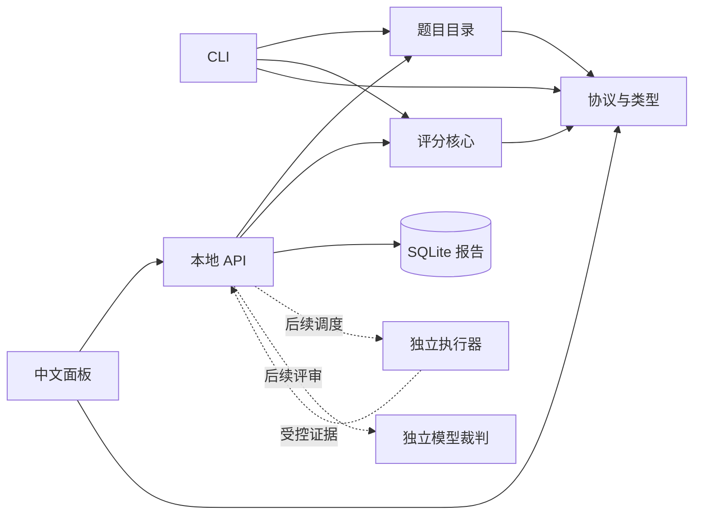
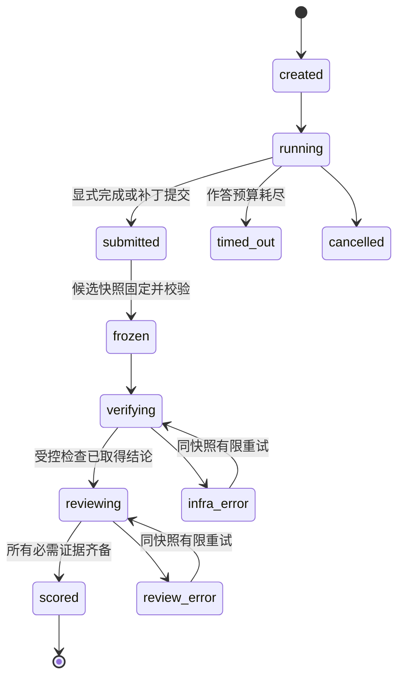

# 技术栈与架构

状态：已确认并完成 M0 初始化。详细实现状态以 [阶段表](roadmap.md) 为准。

## 技术选择

| 范围 | 选择 | 理由与限制 |
| --- | --- | --- |
| 主语言 | TypeScript 6，严格类型检查 | 与六个来源项目的客户端/宿主技术基础一致，协议可共享 |
| 平台运行时 | Node.js 24 LTS；本地基线 24.14.1 | 已在本机验证，主版本限制为 24；正式镜像另锁补丁版本和 digest |
| 依赖管理 | pnpm 11.24.0 workspaces | 一个锁文件，模块依赖显式声明 |
| 前端 | React 19 + Vite 8 | 当前需求为本地管理面板，客户端渲染足够 |
| API | Fastify 5 | 使用受控 JSON Schema 校验边界，关闭隐式类型转换和删除未知字段 |
| 协议 | TypeBox 1 生成 JSON Schema 和 TS 类型 | 减少接口类型与校验规则漂移；运行时只编译平台维护的 Schema |
| 元数据 | SQLite，经 `node:sqlite` | 单机单 API 进程拥有写入；报告单行原子保存，WAL 支持读写重叠 |
| 测试 | Vitest、Playwright；后续按题需要接入 fast-check | 核心算法、协议、持久化与浏览器流程各用适合的验证层 |
| 被测运行时 | TypeScript/Node、F#/.NET 10、Python | 保持来源题的语言特点；不把 F# 线程或 Python 行为伪装成 JS Promise |
| 正式执行环境 | 固定 Linux 容器；Windows 专项独立 worker | 环境档案分开发布，硬件与协议差异不混成一份性能成绩 |

`node:sqlite` 在本机 Node 24.14.1 会产生实验性 API 提示。原生第三方驱动在安装时缺少 Visual Studio C++ 工具链，M0 因而采用实测可用的内置模块。驱动使用集中在 `apps/api/src/store.ts`。正式版本发布前要在锁定的 Node 补丁版本上验证 SQLite 行为与退出/恢复；升级不能只改版本号。

Node 的 LTS 状态参考 [官方发布表](https://nodejs.org/en/about/previous-releases)；Fastify 的 Schema 边界参考 [官方校验文档](https://fastify.dev/docs/latest/Reference/Validation-and-Serialization/)。SQLite 的 [WAL 文档](https://sqlite.org/wal.html)明确同一时刻只有一个写者，不能把本地数据库文件当成多机共享数据库。浏览器环境参考 [Playwright 容器文档](https://playwright.dev/docs/docker)。

## 模块与依赖

| 模块 | 当前职责 | 禁止依赖 |
| --- | --- | --- |
| `packages/contracts` | Schema、类型、评分常量 | 数据库、浏览器框架、进程管理 |
| `packages/core` | 证据结构检查、纯分数计算、四级汇总 | 文件、网络、模型 SDK、具体题目实现 |
| `packages/catalog` | 加载与验证目录、查询题目 | API、Web、评分执行副作用 |
| `packages/tasks` | 题目包 manifest 校验、白名单导出、受信检查执行 | 模型调用、前端、候选代码执行 |
| `packages/runs` | 候选树摘要、提交信封校验、冻结快照、幂等索引与物化 | 模型调用、前端、评分计算、候选代码执行 |
| `packages/executor` | 物化被测对象、按固定命令执行、解析检查、故障分类与资源采样；`container.ts` 负责容器档案（固定镜像、限额、只读隐藏检查） | 模型调用、前端、评分计算、决定通过标准 |
| `packages/static` | 冻结规则的静态客观分：函数决策点/长度阈值与禁止导入 → 简洁度、可维护性、解耦性 | 解析 AST、访问网络、决定质量维度（仍需评审分合成） |
| `packages/judge` | 评审配置（只从 `BENCH_JUDGE_*` 读取）、预算控制、判决协议校验；模型调用由调用方注入 | 直接发 HTTP、把令牌写进配置或运行档案、在缺配置时产出评语 |
| `apps/cli` | 列目录、查看题目、输入评分 JSON | Web、API 内部存储实现 |
| `apps/api` | 校验入口、保存和读取预览报告 | 前端组件、候选代码执行 |
| `apps/web` | 展示与筛选、显式示例评分 | 文件系统、SQLite、宿主工具 |

执行器需要进程与权限隔离；这不要求所有业务都拆成微服务。M0 保持三个应用、三个小包；M1 增加题目包、运行控制面与执行器三个小包（`packages/tasks`、`packages/runs`、`packages/executor`）。后续执行器和裁判适配器以必要的进程边界接入，不建立通用插件框架或工作流 DSL。

## 当前 API 与命令

| 入口 | 行为 |
| --- | --- |
| `GET /api/health` | 返回初始化阶段与尚未接入的正式能力 |
| `GET /api/tasks` | 返回 55 道题目元数据 |
| `GET /api/previews` | 返回最近 100 条保存的评分预览 |
| `POST /api/previews` | 验证输入、计算并原子保存一条预览，返回 201 |
| `POST /api/runs` | 正式提交入口：需要 `x-bench-token`，候选目录必须位于 `BENCH_SUBMISSIONS_DIR` 之内，冻结后自动触发验证 |
| `GET /api/runs` | 列出运行记录的状态摘要 |
| `GET /api/runs/:runId/:attemptId` | 返回阶段、已知失败、可重试原因与证据引用 |
| `GET /api/runs/:runId/:attemptId/report` | 导出该次运行的 Markdown 报告（检查表、评分、证据） |
| `bench list / show` | 查看题目目录或完整元数据 |
| `bench score <file>` | 计算 JSON 输入，可输出 JSON 或 Markdown（预览语义，不执行候选代码） |
| `bench submit <题目> <候选目录> --key <幂等键>` | 正式提交入口：冻结候选快照并自动触发受控验证 |
| `bench status / bench runs` | 查询运行阶段、已知失败、可重试原因与证据 |
| `task:export / task:verify` | 导出候选工作区、对题目包做三向验证 |
| `run:rehearse submit / show / list / materialize / execute` | 提交信封、冻结快照、物化与执行的演练入口，尚无认证与自动触发 |

API 只监听 `127.0.0.1:4318`，Vite 通过同源 `/api` 代理访问。生产托管与多用户认证不在当前范围：正式提交入口用 `BENCH_RUN_TOKEN` 令牌加 `BENCH_SUBMISSIONS_DIR` 路径约束，未配置时入口返回 503 而不是默认放开。输入上限为 256 KiB；接口不接受 shell 命令或任意执行脚本，候选目录必须是提交根目录内的相对路径。

## 正式完成协议与状态机（部分实现）

完成信封包括 `runId`、`attemptId`、`taskVersion`、`baseCommit`、`candidateTreeHash`、`idempotencyKey` 和完成原因，已在 `packages/contracts` 冻结为 0.1.0；提交信封校验、候选快照冻结与幂等记录已由 `packages/runs` 实现（见 [M1-02 Note](notes/implemented/feature/2026-09-14-submission-freeze-control-plane.md)）。worker 的最终事件或显式 `bench submit` 可产生信封；宿主特有事件如 `agent/turn-stopping` 只放在适配器内，不能成为评分核心依赖。宿主执行与资源采样已由 `packages/executor` 实现（见 [M1-03 Note](notes/implemented/feature/2026-09-14-minimal-executor-and-fault-classification.md)）；容器档案（固定镜像与 digest、`--network none`、CPU/内存/PID 限额、隐藏检查只读挂载、docker 失败码归类）也已实现并通过单元测试与拒绝路径演练（见 [容器档案 Note](notes/implemented/feature/2026-09-14-container-profile-and-pinned-image.md)）。**尚未在真实容器里运行过**：本机没有容器运行时；评审、状态与事件查询以及状态机的其余转移仍未实现。

重复完成事件以幂等键与快照哈希判定：同键同快照返回原 run；同键不同快照报冲突。迟到事件通过 attempt/generation 拒绝。冻结之后提交区不再可写；后续修改是新 attempt。基础设施重试不算新的模型作答，修复补丁属于新的作答。

## 正式执行与信任边界（部分实现）

候选代码、日志及文件中的指令均是不可信输入。题目作者维护启动命令白名单和校验器；不直接执行候选提供的命令。构建依赖预先安装并锁定，正式运行关闭不需要的外网，仅开放受控模拟服务。

`packages/executor` 已实现：只从冻结快照物化被测对象、只运行题目包 manifest 里的固定命令、受信侧注入隐藏检查、自己解析检查结果、区分超时/内存耗尽/取消/基础设施故障并回收整棵进程树（见 [M1-03 Note](notes/implemented/feature/2026-09-14-minimal-executor-and-fault-classification.md)）。宿主执行时 `profile=local`、`isolation=none`，没有网络阻断，资源上限目前只有墙钟预算与 node 堆上限；容器档案在容器运行时可用前一律拒绝执行。

候选容器不能访问裁判凭据、题库隐藏资产、结果数据库或宿主 Docker socket。黑盒检查由外部验证器驱动；必须在候选进程内执行的检查视为有泄漏风险，不能宣称物理保密。高完整性结果需要独立验证进程和外部观测证据，不能只信任候选 stdout 中的“PASS”。Windows 专项需独立低权限执行身份/沙盒，并用 Job Object 管理后代进程。

测试进程、资源采样器、事件记录和裁判使用同一冻结候选哈希。核心评分只接收验证后的固定结构；模型无法通过输出一个高总分覆盖真实检查失败。
